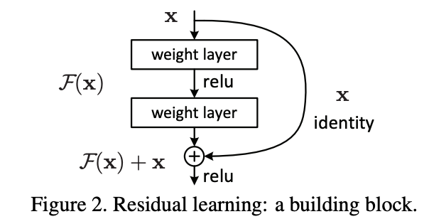

## Lesson7

#### Resnets

Resnets came from one amazing researcher intution Kamming who understood that
Conv nets can be made better by stacking things up together.

Rather than earlier understanding of:

`Output = Conv2(Conv1(x))`

he said

`Output = x + Conv2(Conv1(x)) `

His theory was 56 layers worth of convolutions in that has to be at least good as the 20 layer version because it could always just set conv2 and conv1 to a bunch of 0 weights for everything except for the first 20 layers because the X (i.e. the input) could just go straight through. So this thing here is (as you see) called an identity connection. It's the identity function - nothing happens at all. It's also known as a skip connection.

#### Densenets

Densenet- instead of weight + relu pattern followed by usual Resnets.
We use concat function between two layer to do the intented functionaliy.
Denseblocks get bigger and bigger
They work really well for segmentation
Resnets - skip connection

#### GANS

- Turn crappy images to good images (lesson7-superres-gans)
Choose the proper functions and use appropriate resizing. If crappy is not proper
make it do that.
`unet_learner` can work in these datasets. And use imagenet stats
blur, norm_type and self_attention = new functions

`learn_get make it fit for gans`
water map removal is done in small amount of time

A loss function which calls another model using `GANS`.

Crappy image-> Generator->prediction
discriminator(critics) -> pred
In `fastai` new approach with pretrained models for Generator and Discriminator.

## Coding

- a seperate file for new folder generator and critic
- nn.BCEWIthLogitsLoss for `loss_critic`
- not using resnet but gan_critic() for model.
- GANS hate momentum and with `GANLearner`
- Loss in the  gans should have same critics and discriminator learning
- some critics are really bad. The eyeballs of cat in critic does not know if
it's proper

Unets are when size of output is equal to size of input.
eg: Segmentation,

`lesson7-wgan`: do check out
- downsampling unet encode and upsampled decoder

#### Superes Loss

- used F11 loss
- Feature loss class:
m_feat is the pretrained loss
use vgg_16_bnn for pretrained loss
All the layers are RELU which are in block
`loss_features`: all layers in network

`make_features`: grab a copy of a layer
intermediate class uses hooks in pytorch
feature loss gives a list and print length as sum
get list which uses learning
// see how cat is finally made in the lecture[1 hr:30 min]

Jason Handik, his project combined gaps. He created old black and white pictures and colourised them. WOw!

For good image restoration, need good crappy functions

#### RNN's

- see how basic NN wiht activation, various layers and shapes
- final output = batch_size* #class

Final Takeout from Jeremy Howards:

- Rewatch lectures 2-3 times to understand concepts
- Practise by applying to real life problems
- Keep on improving

