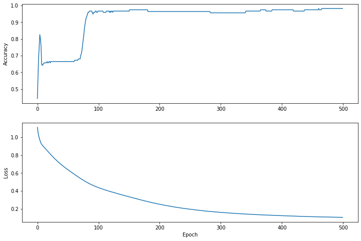

According to Chris Lattner, swift is promised as an infinetely hackable language. I recently binge watched two lessons of FastAI part2 which covered about new language for Deep Learning. 

[Lesson13](https://course.fast.ai/videos/?lesson=13)

[Lesson14](https://course.fast.ai/videos/?lesson=14)

Jeremy Horwards and Sylvian rewrote the entire lessons taught in Part2(Foundations of Deep Learning) in Swift. This notebook can be found in the [course repo](https://github.com/fastai/course-v3/tree/master/nbs/swift).

My first impression after watching these lessons are that swift is an amazing language and in the near future it has a
potential to capture the entire Machine Learning Landscape of Programming Languages like Python and R. It promises to go 
underneath the current barriers of exsisting languages, make Differentiable programming possible.

I am quoting the exact wordings for Swift 4 tensorflow project on type of users its expecting currently:

> a)  **Advanced ML researchers** who are limited by current ML frameworks. Swift for TensorFlow's advantages include seamless integration with a modern general-purpose language, allowing for more dynamic and sophisticated models. Fast abstractions can be developed in "user-space" (as opposed to in C/C++, aka "framework-space"), resulting in modular APIs that can be easily customized.

> b) **ML learners** who are just getting started with machine learning. Thanks to Swift's support for quality tooling (e.g. context-aware autocompletion), Swift for TensorFlow can be one of the most productive ways to start learning the fundamentals of machine learning.


## Importing library and downloading data

In above tutorial, going to do a Model training of Iris 10 dataset to identify from the given image which class of Iris
flower is it part of. Most of code is from [here](https://www.tensorflow.org/swift/tutorials/model_training_walkthrough).


```
import TensorFlow

import Python
%include "EnableIPythonDisplay.swift"
IPythonDisplay.shell.enable_matplotlib("inline")
let plt = Python.import("matplotlib.pyplot")

```


```
import Foundation
import FoundationNetworking

func download(from sourceString: String, to destinationString: String){
    let source = URL(string: sourceString)!
    let destination = URL(fileURLWithPath: destinationString)
    let data = try! Data.init(contentsOf: source)
    try! data.write(to: destination)
}
```


```
download(from: "https://raw.githubusercontent.com/tensorflow/swift/master/docs/site/tutorials/TutorialDatasetCSVAPI.swift" , to: "TutorialDatasetCSVAPI.swift")
```


```
let trainDataFilename = "iris_training.csv"
```


```
download(from: "http://download.tensorflow.org/data/iris_training.csv", to: trainDataFilename )
```


```
// Checking the files in the runtime
let os = Python.import("os")
os.listdir()
```

['.config', 'TutorialDatasetCSVAPI.swift', 'iris_training.csv', 'sample_data']


## Inspect the data


```
let f = Python.open(trainDataFilename)
for _ in 0..<10{
    print(Python.next(f).strip())
}
f.close()
```


120,4,setosa,versicolor,virginica
6.4,2.8,5.6,2.2,2
5.0,2.3,3.3,1.0,1
4.9,2.5,4.5,1.7,2
4.9,3.1,1.5,0.1,0
5.7,3.8,1.7,0.3,0
4.4,3.2,1.3,0.2,0
5.4,3.4,1.5,0.4,0
6.9,3.1,5.1,2.3,2
6.7,3.1,4.4,1.4,1


None


## Image Classification  problem

Imagine you are a botanist seeking an automated way to categorize each iris flower you find. Machine learning provides many algorithms to classify flowers statistically. For instance, a sophisticated machine learning program could classify flowers based on photographs. Our ambitions are more modest—we're going to classify iris flowers based on the length and width measurements of their sepals and petals.

The Iris genus entails about 300 species, but our program will only classify the following three:

- Iris setosa
- Iris virginica
- Iris versicolor


```
let featureNames = ["sepal_length", "sepal_width", "petal_length", "petal_width"]
let labelName = "species"
let columnNames = featureNames + [labelName]

print("Features: \(featureNames)")
print("Label: \(labelName)")
print("Column names:\(columnNames)")

```

Features: ["sepal_length", "sepal_width", "petal_length", "petal_width"]
Label: species
Column names:["sepal_length", "sepal_width", "petal_length", "petal_width", "species"]


```
let classNames = ["Iris setosa", "Iris versicolor", "Iris virginica"]

```

## Create a Dataset API

Swift for TensorFlow's Dataset API is a high-level API for reading data and transforming it into a form used for training.

Eventually, the Dataset API will be able to load data from many file formats. The Dataset API is currently very incomplete, so we include some glue code from "TutorialDatasetCSVAPI.swift" that helps the Dataset API load data from the CSV file into the IrisBatch struct.


```
let batchSize = 32


```


```
struct IrisBatch {
    let features: Tensor<Float>
    let labels: Tensor<Int32>
}

%include "TutorialDatasetCSVAPI.swift"

let trainDataset: Dataset<IrisBatch> = Dataset(
    contentsOfCSVFile: trainDataFilename, hasHeader: true,
    featureColumns: [0, 1, 2, 3], labelColumns: [4]
).batched(batchSize)

```


```
let firstTrainExamples = trainDataset.first!
let firstTrainFeatures = firstTrainExamples.features
let firstTrainLabels = firstTrainExamples.labels
print("First batch of features:\n \(firstTrainFeatures)")

```


First batch of features:
[[6.4, 2.8, 5.6, 2.2],
[5.0, 2.3, 3.3, 1.0],
[4.9, 2.5, 4.5, 1.7],
[4.9, 3.1, 1.5, 0.1],
[5.7, 3.8, 1.7, 0.3],
[4.4, 3.2, 1.3, 0.2],
[5.4, 3.4, 1.5, 0.4],
[6.9, 3.1, 5.1, 2.3],
[6.7, 3.1, 4.4, 1.4],
[5.1, 3.7, 1.5, 0.4],
[5.2, 2.7, 3.9, 1.4],
[6.9, 3.1, 4.9, 1.5],
[5.8, 4.0, 1.2, 0.2],
[5.4, 3.9, 1.7, 0.4],
[7.7, 3.8, 6.7, 2.2],
[6.3, 3.3, 4.7, 1.6],
[6.8, 3.2, 5.9, 2.3],
[7.6, 3.0, 6.6, 2.1],
[6.4, 3.2, 5.3, 2.3],
[5.7, 4.4, 1.5, 0.4],
[6.7, 3.3, 5.7, 2.1],
[6.4, 2.8, 5.6, 2.1],
[5.4, 3.9, 1.3, 0.4],
[6.1, 2.6, 5.6, 1.4],
[7.2, 3.0, 5.8, 1.6],
[5.2, 3.5, 1.5, 0.2],
[5.8, 2.6, 4.0, 1.2],
[5.9, 3.0, 5.1, 1.8],
[5.4, 3.0, 4.5, 1.5],
[6.7, 3.0, 5.0, 1.7],
[6.3, 2.3, 4.4, 1.3],
[5.1, 2.5, 3.0, 1.1]]


```
print("First batch of labels: \(firstTrainLabels)")
```

First batch of labels: [2, 1, 2, 0, 0, 0, 0, 2, 1, 0, 1, 1, 0, 0, 2, 1, 2, 2, 2, 0, 2, 2, 0, 2, 2, 0, 1, 2, 1, 1, 1, 1]


```
let firstTrainFeaturesTransposed = firstTrainFeatures.transposed()
let petalLengths = firstTrainFeaturesTransposed[2].scalars
let sepalLengths = firstTrainFeaturesTransposed[0].scalars

plt.scatter(petalLengths, sepalLengths, c: firstTrainLabels.array.scalars)
plt.xlabel("Petal length")
plt.ylabel("Sepal length")
plt.show()

```


```

```


```
let hiddenSize: Int = 10
struct IrisModel: Layer {
    var layer1 = Dense<Float>(inputSize: 4, outputSize: hiddenSize, activation: relu)
    var layer2 = Dense<Float>(inputSize: hiddenSize, outputSize: hiddenSize, activation: relu)
    var layer3 = Dense<Float>(inputSize: hiddenSize, outputSize: 3)
    
    @differentiable
    func callAsFunction(_ input: Tensor<Float>) -> Tensor<Float> {
        return input.sequenced(through: layer1, layer2, layer3)
    }
}

var model = IrisModel()

```


```
// Apply the model to a batch of features.
let firstTrainPredictions = model(firstTrainFeatures)
firstTrainPredictions[0..<5]

```

[[ 0.21581106,  -0.4621974,  0.25179374],
 [ 0.03792523,  -0.6189664, 0.014299346],
 [ 0.13903831, -0.29850948,   0.1627174],
 [ -0.2161826, -0.80433285,  -0.2289076],
 [ -0.2677291,  -0.8302074, -0.26013878]]


```
softmax(firstTrainPredictions[0..<5])

```


[[0.39304087, 0.19951813, 0.40744105],
 [ 0.4007837, 0.20779046,  0.3914258],
 [0.37459084, 0.24184248, 0.38356668],
 [0.39328128, 0.21841016,  0.3883085],
 [ 0.3879857, 0.22107239, 0.39094183]]


```
print("Prediction: \(firstTrainPredictions.argmax(squeezingAxis: 1))")
print("    Labels: \(firstTrainLabels)")

```


Prediction: [2, 0, 2, 0, 2, 2, 0, 0, 0, 2, 2, 0, 0, 2, 2, 2, 2, 0, 2, 2, 2, 2, 2, 2, 0, 2, 0, 2, 2, 0, 0, 0]
Labels: [2, 1, 2, 0, 0, 0, 0, 2, 1, 0, 1, 1, 0, 0, 2, 1, 2, 2, 2, 0, 2, 2, 0, 2, 2, 0, 1, 2, 1, 1, 1, 1]


```
let untrainedLogits = model(firstTrainFeatures)
let untrainedLoss = softmaxCrossEntropy(logits: untrainedLogits, labels: firstTrainLabels)
print("Loss test: \(untrainedLoss)")

```


Loss test: 1.147685


```
let optimizer = SGD(for: model, learningRate: 0.01)
let (loss, grads) = model.valueWithGradient { model -> Tensor<Float> in
    let logits = model(firstTrainFeatures)
    return softmaxCrossEntropy(logits: logits, labels: firstTrainLabels)
}
print("Current loss: \(loss)")

```

Current loss: 1.147685


```
optimizer.update(&model, along: grads)

```


```
let logitsAfterOneStep = model(firstTrainFeatures)
let lossAfterOneStep = softmaxCrossEntropy(logits: logitsAfterOneStep, labels: firstTrainLabels)
print("Next loss: \(lossAfterOneStep)")

```


Next loss: 1.1295123


```

```


```
let epochCount = 500
var trainAccuracyResults: [Float] = []
var trainLossResults: [Float] = []

```


```

func accuracy(predictions: Tensor<Int32>, truths: Tensor<Int32>) -> Float {
    return Tensor<Float>(predictions .== truths).mean().scalarized()
}

for epoch in 1...epochCount {
    var epochLoss: Float = 0
    var epochAccuracy: Float = 0
    var batchCount: Int = 0
    for batch in trainDataset {
        let (loss, grad) = model.valueWithGradient { (model: IrisModel) -> Tensor<Float> in
            let logits = model(batch.features)
            return softmaxCrossEntropy(logits: logits, labels: batch.labels)
        }
        optimizer.update(&model, along: grad)
        
        let logits = model(batch.features)
        epochAccuracy += accuracy(predictions: logits.argmax(squeezingAxis: 1), truths: batch.labels)
        epochLoss += loss.scalarized()
        batchCount += 1
    }
    epochAccuracy /= Float(batchCount)
    epochLoss /= Float(batchCount)
    trainAccuracyResults.append(epochAccuracy)
    trainLossResults.append(epochLoss)
    if epoch % 50 == 0 {
        print("Epoch \(epoch): Loss: \(epochLoss), Accuracy: \(epochAccuracy)")
    }
}

```


Epoch 50: Loss: 0.6417311, Accuracy: 0.6640625
Epoch 100: Loss: 0.4391577, Accuracy: 0.9661458
Epoch 150: Loss: 0.33583364, Accuracy: 0.9661458
Epoch 200: Loss: 0.2520119, Accuracy: 0.9635417
Epoch 250: Loss: 0.19547871, Accuracy: 0.9635417
Epoch 300: Loss: 0.16002558, Accuracy: 0.9557292
Epoch 350: Loss: 0.13793558, Accuracy: 0.9661458
Epoch 400: Loss: 0.123241246, Accuracy: 0.9739583
Epoch 450: Loss: 0.1116381, Accuracy: 0.9739583
Epoch 500: Loss: 0.104046196, Accuracy: 0.9817708


```
plt.figure(figsize: [12, 8])

let accuracyAxes = plt.subplot(2, 1, 1)
accuracyAxes.set_ylabel("Accuracy")
accuracyAxes.plot(trainAccuracyResults)

let lossAxes = plt.subplot(2, 1, 2)
lossAxes.set_ylabel("Loss")
lossAxes.set_xlabel("Epoch")
lossAxes.plot(trainLossResults)

plt.show()

```


     


```
let testDataFilename = "iris_test.csv"
download(from: "http://download.tensorflow.org/data/iris_test.csv", to: testDataFilename)

```


```
let testDataset: Dataset<IrisBatch> = Dataset(
    contentsOfCSVFile: testDataFilename, hasHeader: true,
    featureColumns: [0, 1, 2, 3], labelColumns: [4]
).batched(batchSize)

```


```
// NOTE: With `batchSize = 32` and 30 examples in the test dataset, only one batch will run in the loop.
for testBatch in testDataset {
    let logits = model(testBatch.features)
    let predictions = logits.argmax(squeezingAxis: 1)
    print("Test batch accuracy: \(accuracy(predictions: predictions, truths: testBatch.labels))")
}

```

Test batch accuracy: 0.96666664


```
let firstTestBatch = testDataset.first!
let firstTestBatchLogits = model(firstTestBatch.features)
let firstTestBatchPredictions = firstTestBatchLogits.argmax(squeezingAxis: 1)

print(firstTestBatchPredictions)
print(firstTestBatch.labels)

```

[1, 2, 0, 1, 1, 1, 0, 1, 1, 2, 2, 0, 2, 1, 1, 0, 1, 0, 0, 2, 0, 1, 2, 1, 1, 1, 0, 1, 2, 1]

[1, 2, 0, 1, 1, 1, 0, 2, 1, 2, 2, 0, 2, 1, 1, 0, 1, 0, 0, 2, 0, 1, 2, 1, 1, 1, 0, 1, 2, 1]


```
let unlabeledDataset: Tensor<Float> =
    [[5.1, 3.3, 1.7, 0.5],
     [5.9, 3.0, 4.2, 1.5],
     [6.9, 3.1, 5.4, 2.1]]

let unlabeledDatasetPredictions = model(unlabeledDataset)

for i in 0..<unlabeledDatasetPredictions.shape[0] {
    let logits = unlabeledDatasetPredictions[i]
    let classIdx = logits.argmax().scalar!
    print("Example \(i) prediction: \(classNames[Int(classIdx)]) (\(softmax(logits)))")
}

```

Example 0 prediction: Iris setosa ([      0.99242,  0.0075798077, 1.0206181e-07])

Example 1 prediction: Iris versicolor ([0.0015674275,    0.9790035,  0.019429056])

Example 2 prediction: Iris virginica ([0.0024372158,    0.2561954,   0.74136734])


So this example showed how we can train a Classification of IRIS flowers. Training a neural network in Swift is a bit
harder at the first insight than Python.

But as **Chris Lattner** said, the promise of Swift having a infinitely hackable language is just wonderful in my
opinion.

## Ending Notes on Swift

- The swift syntax is a bit blocker to develop anything now for me. CamelCase is such a nice good thing
- Yet It’s so rich. But but hard for understanding the syntax.
- Thinks like Protocol, struct are not so intuitive after coming from Python background. Yet maybe people who come from Java background
- If you get your hands wet with iOS development you will learn how much those features are useful.
