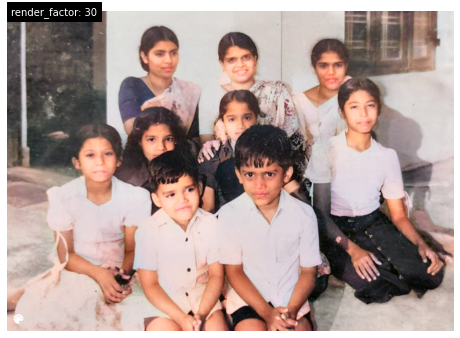
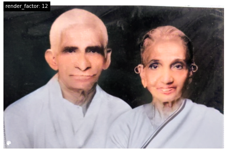
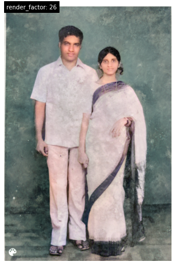
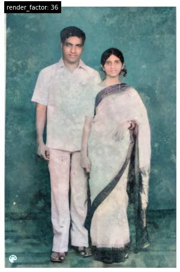
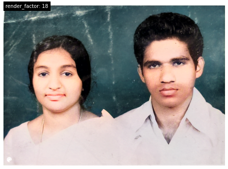
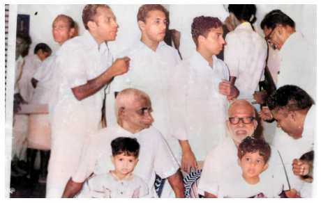
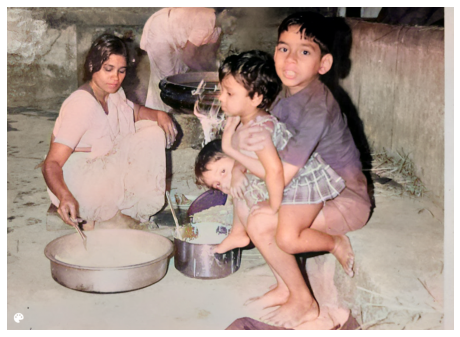
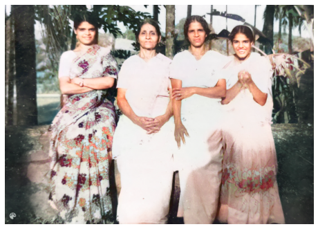

A few day's back, bunch of old photos was posted. It was a perfect opportunity for me to explore about
[Deoldify](https://deoldify.ai/), a software used to colorizing and restoring images & Videos build by fastai student
[Jason Antic](https://twitter.com/citnaj).

Check out some of these images:

