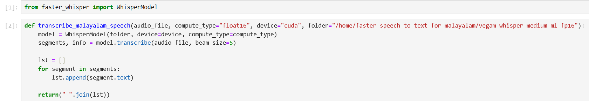
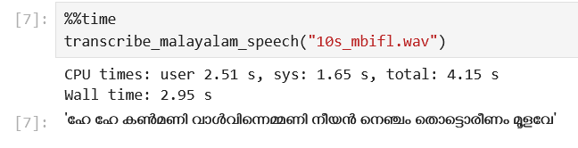
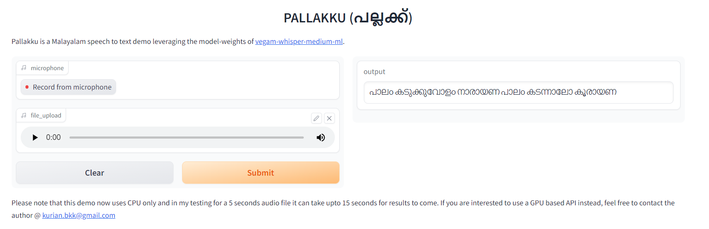

## Links

- [Slides](../../../talks/iiit-kottayam-summit/demo.qmd)
- Scheduled Time: Saturday, June 10, 2023. 2:00 PM IST
- Venue: AA 127, IIIT Kottayam.
- [Pallakku a Malayalam speech to text demo](https://huggingface.co/spaces/kurianbenoy/Pallakku)

## Vegam Whisper Family of Models

Inspired by [faster-whisper](https://github.com/guillaumekln/faster-whisper) which is a 
reimplementation of OpenAI’s Whisper model using CTranslate2 speeds upto 4 times faster
than `openai/whisper` for the same accuracy while using less memory.

CTranslate2 supports various quantization formats and we have trained models for the following
quantization formats:

- float16
- int16
- float8
- int8_float8
- No quantization

For Malayalam, I used the best model in my benchmarking study ie [thennal/whisper-medium-ml](https://huggingface.co/thennal/whisper-medium-ml) and converted into all possible quantization weights.

1. [kurianbenoy/vegam-whisper-medium-ml](https://huggingface.co/kurianbenoy/vegam-whisper-medium-ml)
2. [kurianbenoy/vegam-whisper-medium-ml-fp16](https://huggingface.co/kurianbenoy/vegam-whisper-medium-ml-fp16)
3. [kurianbenoy/vegam-whisper-medium-ml-int16](https://huggingface.co/kurianbenoy/vegam-whisper-medium-ml-int16)
4. [kurianbenoy/vegam-whisper-medium-ml-fp8](https://huggingface.co/kurianbenoy/vegam-whisper-medium-ml-fp8)
5. [kurianbenoy/vegam-whisper-medium-ml-int8_float8](https://huggingface.co/kurianbenoy/vegam-whisper-medium-ml-int8_float8)

## Code to run faster-whisper code

## Demo Video -1 and it's associated Output



> Oru Thai Nadam sang by Venugopal and Sreya, Lyrics by Sugathakumari

## Demo Video -2 and it's associated Output



> Sang by Sithara Krishna Kumar, Lyrics by BK Hari Narayanan. This was a song created spontaneously at MBIFL 2023

## Pallakku

- Pallakku is a Malayalam speech to text demo leveraging the model-weights of whisper family
of models. It might be the first huggingface 🤗 spaces for Malayalam speech to text.

Two options to try it out:

1. [🤗 spaces](https://huggingface.co/spaces/kurianbenoy/Pallakku)

You can try it out in [the below link](https://huggingface.co/spaces/kurianbenoy/Pallakku).

2. GPU-based microservice (coming soon.)

## What is behind the name of Vegam and Pallakku?

- Vegam is a Malayalam word which means speed.
- Pallakku is a Malayalam word which means a palanquin. It is a vehicle which is carried by people.

As an author of these work, I just wanted to say the meaning of these words
doesn't really have anything to do with the package. Vegam might not be the
fastest Malayalam ASR model and Pallakku is named not to refer to the old
colonial times. I just named it for the sake of naming it.

## Thanks to

- [Santhosh Thottingal](https://twitter.com/santhoshtr/) for his support and guidance. Santhosh
told me about faster-whisper and the utility to convert the model weights to various quantization formats.
- Organizers of IIIT Summit 23 for giving me an opportunity to present my work.

## How was the expereince presenting demos?

Demo presentations are events where you can interact with people during the scheduled time.
There was an evaluation panel with one of chief guests of the event [Dr. T Ramalingeswara Rao](https://www.linkedin.com/in/dr-t-ramalingeswara-rao-784a903a/) from TCS and one of the professors.

These sessions brought a hacker kind of vibe back to me. I was really happy to receive lot of 
curious questions and smiles received from folks who came to visit my demo presentation.
I set up the demo in such a way that there was a wireless microphone and I would play a few audio files. They used to rate the output of the model.

Some of my professors who taught me in previous semesters like [Dr. Keshab Nath](https://www.iiitkottayam.ac.in/#!/faculty/keshab) visited to see my
demo and gave me suggestions. It was a nice vibe to interact with a bunch of BTech students in their
second semester from Andhra Pradhesh. Even though they were not able to understand Malayalam, they
just hung around and asked me questions :D.
