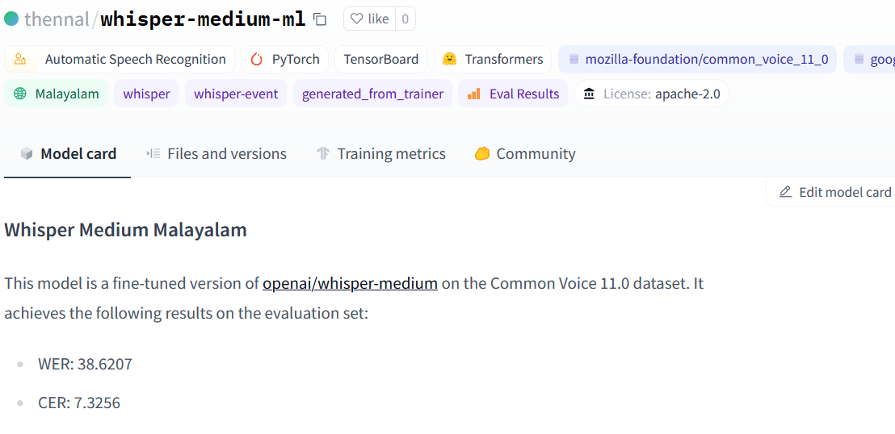
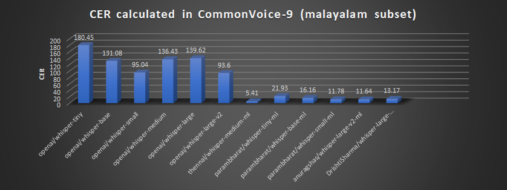
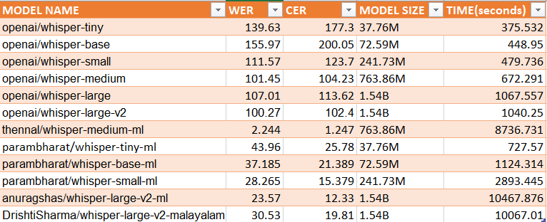
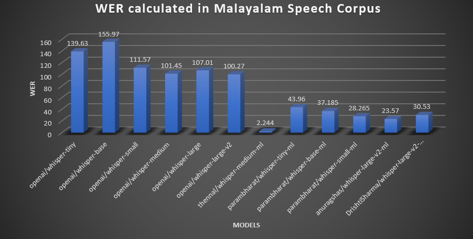
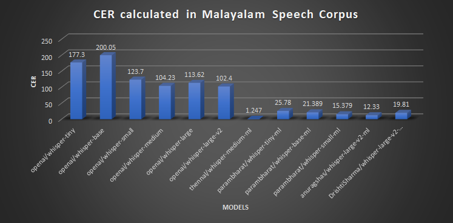

## Outline

- About Malayalam
- malayalam_asr_benchmarking nbdev project
- vegam-whisper-medium ml model and Pallakku

## $whoami

- AI Engineer & Team Lead @ Sentient.io
- Volunteer @ Swathanthra Malayalam Computing(SMC)
- xMECian
- Open-source enthusiast
- Not affiliated to OpenAI

## Disclaimer

- <span style="color:red">Nothing in this talk is generated.</span>

unless explicitly marked, or in a screenshot from an LLM

## About Malayalam

## About Malayalam

::: {.incremental}
- <span style="color:red">Malayalam is my mother tongue.</span>
- <span style="color:blue">Native speakers: 38+ million.</span>
- <span style="color:green">Spoken in: Kerala, Lakshadweep, Puducherry, wherever Mallus is living.</span>
:::

## Malayalam is a morphologically complex language

::: {.incremental}
- <span style="color:red">It has complex morphology compared to other languages English, Tamil, Hindi, Spanish, Finnish etc.</span>
- <span style="color:blue">Morphology can be calculated by metrics like TTR and MATTR [1], [2]</span>

::: aside
[1] Juola, P.: Measuring linguistic complexity: The morphological tier. Journal of
Quantitative Linguistics 5(3), 206–213 (1998)

[2] Kettunen, K.: Can type-token ratio be used to show morphological complexity of
languages? Journal of Quantitative Linguistics 21(3), 223–245 (2014)
:::

:::


## Types and Tokens

::: {.incremental}
- <span style="color:red">To be or not to be is question</span>
- <span style="color:blue">Type count: 7</span>
- `Token count: 9`
:::

## Type Token Ratio (TTR)

```{=tex}
\begin{gather*}
TTR = \frac{\text{Type count}}{\text{Token count}}
\end{gather*}
```

- <span style="color:red">To be or not to be is question</span>

```{=tex}
\begin{gather*}
TTR = 7 \div 9
\end{gather*}
```

##


##


::: aside
Information from [Quantitative Analysis of the Morphological
Complexity of Malayalam Language by K. Manohar et al.](https://link.springer.com/chapter/10.1007/978-3-030-58323-1_7)
:::

## Malayalam_asr_benchmarking project

## OpenAI Whisper

{width=500 fig-align="center"}

- <span style="color:red">I think Whisper^[<span style="color:black">According to [research paper](https://cdn.openai.com/papers/whisper.pdf) p.2, the name Whisper is an abbrevation for WSPR: `Web-scale Supervised Pretraining for Speech Recognition`.</span>] is the most `under-rated model` released by OpenAI.</span>
- <span style="color:green">It was open-sourced on September 21, 2022 by releasing the inference code and pre-trained model weights.</span>

## About OpenAI Whisper Model

- Whisper is a computer program which can listen to people talking and write down what they say. <span style="color:red">(Automatic Speech Recognition Model)</span>
- Whisper can understand people speaking different languages and can even translate what they say into English. <span style="color:green">(Supports transcription and translation to English)</span>

::: aside
<span style="color:black">Note: This was generated with GPT-4 with prompt: explain what is openai whisper to a 5 year old kid?</span>
:::

## Malayalam is a complex language

{width="800"}

::: aside
<span style="color:black">Picture from [Quantitative Analysis of the Morphological
Complexity of Malayalam Language by K. Manohar et al](https://link.springer.com/chapter/10.1007/978-3-030-58323-1_7). For more information check this paper.</span>
:::

## Whisper Event

- <span style="color:red">HuggingFace Team conducted a whisper fine tuning event for 2 weeks from 5th December 2022 to 19th December 2022. The results were out on 23rd December 2022.</span>
- <span style="color:blue">The goal was to to fine-tune the Whisper model to build state-of-the-art speech recognition systems in the languages of our choice 🗣 </span>

::: aside
[Whisper Event huggingface page](https://huggingface.co/whisper-event)
:::

## Malayalam models produced in Whisper Event

- <span style="color:red">For the language Malayalam, the results are as follows:</span>

</span>](malayalam_models.png){width=700 fig-align="center"}

## Winning models in Malayalam in Whisper Event {.nonincremental}

- <span style="color:red">The winning model for Common voice</span>: `thennal/whisper-medium-ml`
- <span style="color:blue">The winning model for Fleurs</span>: `parambharath/whisper-small-ml`

## I was not convinced

- <span style="color:red">Didn't trust the Hugging Face way of evaluating models.</span>




## I was not convinced

- <span style="color:red">Didn't trust the Hugging Face way of evaluating models.</span>


## Objective of my benchmarking

- <span style="color:red">To test whether 10% WER was possible in available academic datasets.</span>

**Datasets**

- <span style="color:blue">Common Voice 11 malayalam subset</span>
- <span style="color:blue">SMC Malayalam Speech Corpus</span>

## Metrics for evaluating ASR models

- ASR evaulation relies on comparission between <span style="color:red">ground-truth</span> and <span style="color:red">ASR output</span>.
- <span style="color:blue">Common metrics for ASR evaluation which are popular and good enough^[<span style="color:black">According to Rethinking Evaluation in ASR: Are our models robust enough? by Likhomanenko T, Xu, Q., Pratap etc.</span>] are</span> :

<span style="color:green">1. Word Error Rate(WER)</span>

<span style="color:green">2. Character Error Rate(CER)</span>

::: aside
<span style="color:black">To learn more about ASR evaluation check this [blogpost by AWS](https://aws.amazon.com/blogs/machine-learning/evaluating-an-automatic-speech-recognition-service/)</span>
:::

## I wanted to build something new

- <span style="color:red">New github project for [Malayalam ASR Benchmarking](https://github.com/kurianbenoy/malayalam_asr_benchmarking)</span>


## Methadology for benchmarking

1. <span style="color:red">Create as a python library so further whisper-based transformer models can be benchmark.</span>
2. <span style="color:blue">Calculate WER, CER, model size and time taken to benchmark the model for the listed datasets.</span>
3. <span style="color:green">Build a reproducible approach, so results of benchmarking is stored as dataset.</span>


## Benchmarked models

- <span style="color:red">Started with 6 fine-tuned models in Malayalam and compared it with [6 model versions released by OpenAI](https://github.com/openai/whisper).</span>

1. thennal/whisper-medium-ml
2. parambharat/whisper-tiny-ml
3. parambharat/whisper-base-ml
4. parambharat/whisper-small-ml
5. anuragshas/whisper-large-v2-ml
6. DrishtiSharma/whisper-large-v2-malayalam


## Results on benechmarking in Common Voice dataset


## WER in Common Voice dataset


## CER in Common Voice dataset



##



##



## Results on benechmarking in Malayalam Speech Corpus dataset



## WER in Malayalam Speech Corpus



## CER in Malayalam Speech Corpus



## Links to Project

<span style="color:red">Github project</span>

 <span style="color:black">https://github.com/kurianbenoy/malayalam_asr_benchmarking</span>

## Links to Project 

<span style="color:blue">Benchmarking results</span>

 - <span style="color:orange">Results on SMC Malayalam Speech corpus</span>
 
 https://huggingface.co/datasets/kurianbenoy/malayalam_msc_benchmarking/tree/main
 
 - <span style="color:orange">Results on Common Voice 11</span>
 
 https://huggingface.co/datasets/kurianbenoy/malayalam_common_voice_benchmarking

## Future Ideas for Benchmarking

- <span style="color:red">Something very similar to OpenLLM Leaderboard with results of latest malayalam speech models.</span>
- <span style="color:blue">Should include results for Kaldi, Meta's MMS, Wav2Vec etc.</span>

](../delft-fastai/openllm.png)


## vegam-whisper-medium ml model and Pallakku

## Inspired by

::: {.incremental}
- <span style="color:red">[faster-whisper](https://github.com/guillaumekln/faster-whisper) is a reimplementation of OpenAI's Whisper model using CTranslate2, which is a fast inference engine for Transformer models.</span>
- <span style="color:blue">This implementation is up to 4 times faster than openai/whisper for the same accuracy while using less memory. The efficiency can be further improved with 8-bit quantization on both CPU and GPU.</span>
:::

::: aside
Information from [faster-whisper github README](https://github.com/guillaumekln/faster-whisper)
:::

## CTranslate2

- <span style="color:red">It had this utility for converting any `whisper` based model to faster-whisper like models.</span>

```shell
ct2-transformers-converter \
 --model openai/whisper-tiny \
 --output_dir whisper-tiny-ct2
```

## Vegam Whisper models released

- <span style="color:red">I used `thennal/whisper-medium-ml` to convert it to faster-whisper based models for Malayalam:</span>

1. [kurianbenoy/vegam-whisper-medium-ml](https://huggingface.co/kurianbenoy/vegam-whisper-medium-ml)
1. [kurianbenoy/vegam-whisper-medium-ml-fp16](https://huggingface.co/kurianbenoy/vegam-whisper-medium-ml-fp16)

## Pallakku

- <span style="color:red">Pallakku is a Malayalam speech to text demo leveraging the model-weights of vegam-whisper-medium-ml.</span>
- Now hosted as:

1. [🤗 spaces](https://huggingface.co/spaces/kurianbenoy/Pallakku)
2. GPU-based microservice (coming soon.)

## 🤗 spaces


## Thanks to

:::: {.columns}
::: {.column width="70%"}
1. [OpenAI team](https://openai.com/) - Alec Radford, [Jong Wook Kim](https://github.com/jongwook), [Christine McLeavey](https://www.linkedin.com/in/mcleavey) etc. other authors of [Whisper paper](https://cdn.openai.com/papers/whisper.pdf)
2. Creators of [CTranslate2](https://opennmt.net/CTranslate2) and [faster-whisper](https://github.com/guillaumekln/faster-whisper) - [Guillaume Klein](https://github.com/guillaumekln)
3. [HuggingFace team](https://huggingface.co/) - [Sanchit Gandhi](https://huggingface.co/sanchit-gandhi), [Nicolas Patry](https://huggingface.co/Narsil), [Vaibhav Srivastav](https://github.com/Vaibhavs10) etc.
4. [Kavya Manohar](https://kavyamanohar.com/)
5. [Santhosh Thottingal](https://thottingal.in/)
:::

::: {.column width="30%"}
6. [Thennal D K](https://huggingface.co/thennal)
7. Other members in [Swathanthra Malayalam Computing community](https://smc.org.in/).
8. [Jarvis Labs](cloud.jarvislabs.ai/)
:::
::::

